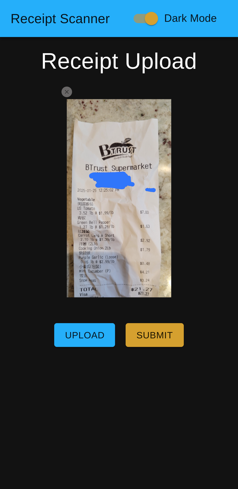

# Receipt Scanner

Receipt Scanner is a modern web-based application that allows users to upload receipt images and process them into structured data. The system uses OpenAI's vision models to extract itemized information from the receipts and presents it as a downloadable CSV table. It consists of a React frontend and a FastAPI backend.



---

## Features

- **AI-Powered Receipt Processing:** Extracts detailed, structured information from receipt images.
- **File Upload:** Easily upload receipt images directly through the web interface.
- **CSV Export:** Output structured receipt data as a downloadable CSV file.
- **Dynamic UI:** Responsive, clean interface built with React.
- **PWA Ready:** Installable as a Progressive Web App for mobile and desktop environments.
- **Environment-Specific Configurations:** Support for development and production environments.
- **Cross-Origin Compatibility:** CORS enabled for backend requests.

---

## Getting Started

### Prerequisites
Ensure you have the following installed on your system:

- Docker
- Docker Compose

### Directory Structure
```
receipt-scanner/
├── frontend/
│   └── receipt-scanner/  # React frontend code
├── backend/
│   └── app/              # FastAPI backend code
├── docker-compose.yml     # Docker Compose configuration
└── .env                   # Environment variables for backend
```

### Environment Variables

Create a `.env` file in the project directory with the following secret variables:

```env
ORGANZIATION_KEY=*****
PROJECT_KEY=*****
GPT_API_KEY=*****
POSTGRES_HOST=*****
POSTGRES_PORT=*****
POSTGRES_USER=*****
POSTGRES_PASSWORD=*****
POSTGRES_DB=*****
POSTGRES_TABLE=*****
```

### Development Setup
To spin up the development environment, run:

```bash
docker-compose up --build
```

This will launch both the frontend and backend services:

- **Frontend:** [http://localhost:3000](http://localhost:3000)
- **Backend:** [http://localhost:8000](http://localhost:8000)

---

## Usage

1. **Upload Receipt:** Open the frontend app and click the "Upload" button to select a receipt image, then click "Submit" to send the image for processing
2. **Process Receipt:** After submitting, the backend processes the image using AI and writes itemized table to postgres.

---

## Troubleshooting

- **Frontend Not Loading:** Ensure that `CHOKIDAR_USEPOLLING=true` is set in the environment variables.
- **API Connection Issues:** Verify that `REACT_APP_API_URL=http://localhost:8000` is correctly set.
- **CORS Issues:** Ensure `ALLOWED_ORIGINS=*` is set in the backend environment variables.
- **Permission Errors:** Use `sudo` for Docker commands if required.

---

## Future Improvements
- Add user authentication.
- Enhance AI model accuracy.
- Allow users to view, edit, and manage processed items.
- Allow users to view their data via a dashboard

---

## License
This project is licensed under the MIT License.

